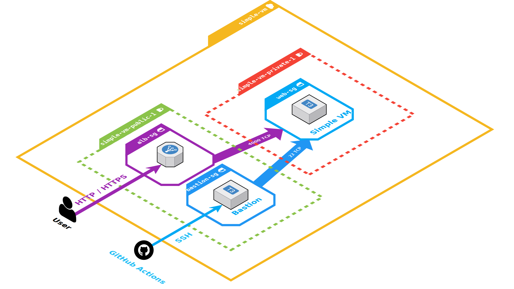

# Overengineered Website Hosting - OWH

[](https://simple-vm.shiny-infra.xyz/)
[](http://makeapullrequest.com)

[](https://forthebadge.com) 

Overengineered way of setting up a static webpage hosting to make the best use of my time to shine.

# Table of contents

- [Task overview](#task-overview)
- [Solution](#solution)
    - [Infrastructure overwiew](#infrastructure)
    - [Provisioning](#provisioning)
    - [Monitoring](#monitoring)
- [Requirements](#requirements)
- [Usage](#usage)
- [License](#license)

# Task overview

I was tasked with: 

- creating a LinuxVM that is only accessible via ssh keys
- running a web server which will serve a static page displaying "Hello my name is <yourname>". It should use scripts to connect to said machine and deploy a simple website there
- creating a monitoring script, that verifies whether the site is up: [](https://simple-vm.shiny-infra.xyz/)

I decided to have some fun with it and create a "production ready" solution.

# Solution

## Infrastructure overview

[(Back to top)](#table-of-contents)

The website is served by **nginx** web server, running in **docker** container, on the **Simple VM** virtual machine.

Simple VM is an **AWS EC2** instance.
It is created in a **private subnet**, so it cannot be accessed directly from the Internet.

User access (HTTP/HTTPS) is handled by **AWS Application Load Balancer**.
It terminates TLS using certificate generated with AWS Certificate Manager (ACM).

Management access to Simple VM is possible with SSH, using the **bastion** host.
It is used by **GitHub Actions** to deploy new versions of the application.

The entire infrastructure for the project is contained in this repository, in **terraform** files.

### Diagram


## Provisioning

The web server is provisioned using an **Ansible** playbook.
Ansible connects to the VM using SSH, tunneling via the bastion host.

It uses aws_ec2 **dynamic inventory** to get VM's IP address.

## Monitoring

For a simple health check there's the `monitoring_script.sh`.
It performs a HTTP GET request and if the result differs from the expected value, it sends an email to defined recipients.

The script can be run with `cron`.

The biggest issue with this approach is the fact that the script doesn't save the previous state and will continue to send emails again and again, with each run (as long as the website is down).

I plan to add **Prometheus** with **Alertmanager** and **Blackbox exporter** to this project, to handle monitoring and alerting properly. 

Additionally, the 
[](https://simple-vm.shiny-infra.xyz/)
badge shows the current status of the website 😉. Click it to see for yourself.


# Requirements

- AWS account with sufficient access to create the resources
- `terraform >= 0.14`
- `ansible`

# Usage

[(Back to top)](#table-of-contents)

Setting up the project is partially automated with GitHub Actions.

## AWS resources

### Manual steps

#### I. terraform boilerplate

S3 bucket and DynamoDB table to store terraform state.

This step is a bit complex, due to the way how terraform handles state by default.

1. `cd iac/terraform_boilerplate`

2. `cp terraform.tfvars.example terraform.tfvars` 

3. Modify `terraform.tfvars` accordingly.

4. Edit `state.tf` file.
   - Change the bucket name in the marked line to the one set in `terraform.tfvars`
   - Comment (with `#`) the marked lines out. This is necessary, because the bucket does not exist yet.

5. `terraform init && terraform apply`

6. Edit `state.tf` file again.
   - Uncomment the lines commented in the previous step.

7. `terraform init && terraform apply`

#### II. DNS zone

This step creates Route53 hosted zone. 
It's called "do not destroy", because this resource does not generate any costs and recreating it might force you to make changes in DNS setup outside AWS 
(since new hosted zone might get different nameservers).

1. `cd iac/DNS_do_not_destroy`

2. `cp terraform.tfvars.example terraform.tfvars` 

3. Modify `terraform.tfvars` accordingly.

4. Edit `versions-state.tf` file.
   - Change the bucket name in the marked line to the one created in [step I](#i-terraform-boilerplate)

5. `terraform init && terraform apply`

Set up your domain's DNS NS records according to [this guide](https://docs.aws.amazon.com/Route53/latest/DeveloperGuide/migrate-dns-domain-inactive.html).

#### III. Stage specific resources

This step creates the VPC, ALB and the bastion host.

1. `cd iac/stage_specific_resources`

2. `cp terraform.tfvars.example terraform.tfvars` 

3. Modify `terraform.tfvars` accordingly.

4. Edit `terraform_boilerplate.tf` file.
   - Change the bucket name in the marked line to the one created in [step I](#i-terraform-boilerplate)

5. `terraform init && terraform apply`

### GitHub Actions

Steps below are executed in GitHub Actions pipeline.
However, if you wish to run it manually (without forking the repo and setting up your own pipeline), see the instructions below.

#### IV. The VM itself

In the repo root directory:

1. `cp terraform.tfvars.example terraform.tfvars` 

2. Modify `terraform.tfvars` accordingly.

3. Edit `terraform_boilerplate.tf` file.
   - Change the bucket name in the marked line to the one created in [step I](#i-terraform-boilerplate)

4. `terraform init && terraform apply`

## Website deployment

Website deployment is automated with GitHub Actions and Ansible. Manual steps:

1. In the repo root directory run:

``` shell
export PATH_TO_YOUR_PRIVATE_KEY='~/.ssh/id_rsa'  # Modify as needed.
export IP_PUB=$(aws ec2 describe-instances --filters 'Name=tag:Instance,Values=Bastion' --query 'Reservations[*].Instances[*].PublicIpAddress' --output text)
ansible-playbook -i inventories/dynamic_aws_ec1.yml provision.yml --ssh-common-args "-J ubuntu@$IP_PUB" --private-key $PATH_TO_YOUR_PRIVATE_KEY
```

You may need to modify the `--filters` above if you changed the tags for the bastion instance or if you have more than one instance with such tags in your account. 

# License

[(Back to top)](#table-of-contents)


The MIT License (MIT) 2021 - [Michalina Andrzejewska](https://github.com/andrmich/). Please have a look at the [LICENSE.md](LICENSE.md) for more details.


